# Architectural Guide: The FeedGen Control Center

The **FeedGen Control Center** is a self-contained, zero-intrusion management suite designed to democratize, optimize, and scale the generation of high-quality product feeds using Google Cloud and state-of-the-art Large Language Models (LLMs). 

This guide details **why** this architecture was built, the strategic decisions behind its infrastructure, and how it delivers massive cost and scalability benefits.

---

## 🗺️ High-Level Architecture

The Control Center operates as a modular, non-intrusive management layer built on top of the existing FeedGen data pipeline. It does **not** modify or pollute your core production scripts.

```mermaid
flowchart TD
    subgraph User Space
        User([Digital Marketer / Engineer]) <--> TUI[Control Center TUI]
    end

    subgraph Control Center Manager
        TUI <--> State[state.json]
        TUI <--> Service[Services Layer]
    end

    subgraph Google Cloud Platform
        Service --> BQ[(BigQuery Input / Output)]
        Service --> GCS[(Google Cloud Storage)]
        Service --> Vertex[Vertex AI Batch Predictions]
    end
    
    style User Space fill:#2a2a2a,stroke:#444,stroke-width:2px
    style Control Center Manager fill:#1e1e1e,stroke:#009E73,stroke-width:2px
    style Google Cloud Platform fill:#111,stroke:#E69F00,stroke-width:2px
```

---

## 🌟 Key Architectural Pillars

### 1. Democratic Accessibility (Zero-Code TUI)
Traditionally, deploying and configuring enterprise feed pipelines requires deep familiarity with terminal commands, SQL queries, GCP IAM roles, and raw API specifications. This locks out the people who understand the catalog best: **digital marketers and product managers.**

* **No-Code Operations**: The Textual-based Terminal User Interface (TUI) wraps all complex cloud API calls, dataset creations, IAM policy adjustments, and schema mapping into a self-guided, keyboard/mouse-interactive wizard.
* **Safety & Guardrails**: Built-in validation shields users from misconfigurations, verifying schema presence (e.g., checking for required `id` fields) and GCP connection status in real-time before executing jobs.

---

### 2. Vertex AI Batch Predictions (Scalability & Cost Efficiency)
Rather than relying on real-time online inference APIs or expensive BigQuery ML dedicated slots, the Control Center is designed around **Vertex AI Batch Predictions**.

| Metric | Real-Time APIs (Online Inference) | Vertex AI Batch Predictions |
| :--- | :--- | :--- |
| **Cost** | Standard retail per-token price. | Highly optimized batch pricing (often heavily discounted). |
| **Rate Limits & Quotas** | High risk of `429 Resource Exhausted` errors on large catalogs. | Built for massive catalogs. Automatically handles parallel scaling. |
| **Execution Pattern** | Synchronous; locks caller thread and times out on long jobs. | Asynchronous; runs reliably in GCP background, auto-saving progress. |
| **Failure Recovery** | Hard to resume; requires manual tracking of failed items. | Seamless resumption; can poll and reconnect to active jobs on restart. |

By switching to batch predictions, the architecture bypasses the strict rate-limiting constraints of real-time generation, allowing catalogs with millions of products to be processed concurrently and asynchronously.

---

### 3. Support for the Latest & Third-Party Models
Using a standard API interface means the pipeline is instantly compatible with the most advanced models offered by Google and its partners, keeping your architecture future-proof:

* **State-of-the-Art Gemini**: Leverages the extreme speed, cost efficiency, and vast context window of **Gemini 3.5 Flash** and the reasoning capacity of **Gemini 2.5 Pro**.
* **Partner Models**: Supports Anthropic’s **Claude 3.5 Sonnet** and **Claude 3.5 Haiku** via Vertex Model Garden, giving you access to top-tier reasoning without managing external API keys or exposing data outside your cloud compliance boundaries.

---

## 📂 Zero-Intrusion Design

One of the primary design goals was to introduce these complex capabilities **without modifying a single line of your existing production code**. 

* **Isolated Module**: All UI logic, state management, and orchestration services reside inside the `bigquery/control_center/` directory.
* **State Decoupling**: All operational metadata, settings, and job tracking are isolated in an atomic `state.json` manager. Your codebase remains pristine, clean, and easy to maintain.
* **Stateless Services**: The services layer acts as a clean client wrapper to BigQuery and Vertex AI, keeping business logic fully isolated and 100% mock-testable.

---

## 🚀 Summary of Business Value
1. **Empower Non-Technical Teams**: Marketers can self-serve, test prompts, and run exports without waiting on engineering backlogs.
2. **Cut Cloud Expenses**: Batch processing scales down costs while maximizing token efficiency.
3. **Zero Integration Debt**: Plug-and-play architecture that deploys instantly over your existing tables without breaking legacy systems.
