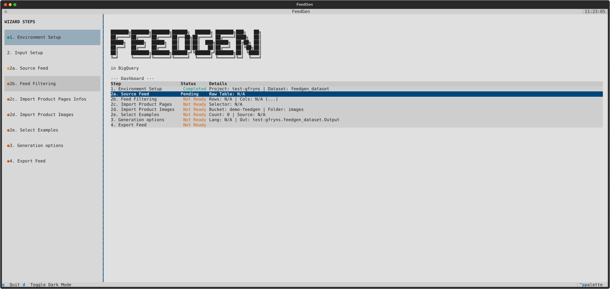

# FeedGen BigQuery Control Center

The **FeedGen BigQuery Control Center** is an interactive, terminal-based User Interface (TUI) designed to automate the deployment and configuration of an e-commerce feed generation pipeline on Google Cloud. 

Using this control center, digital marketers and data engineers can seamlessly deploy a BigQuery-native infrastructure to enhance product titles and descriptions using Google's Gemini Large Language Models (LLMs).

<br>
*(Built with [Textual](https://textual.textualize.io/))*

## 🚀 Features

*   **Interactive TUI:** A sleek, keyboard- and mouse-friendly terminal interface with real-time validation, progress bars, and streaming deployment logs.
*   **Infrastructure as Code:** Automatically enables required GCP APIs (Vertex AI), provisions BigQuery Datasets, and creates Cloud Resource Connections with proper IAM role bindings.
*   **Vertex AI Integration:** Leverages Vertex AI Batch Predictions for scalable and parallelized generation using Gemini and Claude models, bypassing BigQuery ML limitations.
*   **Data Preparation:** 
    *   Previews raw input tables directly in the terminal.
    *   Provides a visual mapping interface to align your custom schema (ID, Title, Description, Image URL) to the pipeline's expected format.
    *   Supports dynamic SQL filtering.
*   **Data Enrichment (Optional):**
    *   **Web Scraping:** Automatically extracts additional text content from product detail pages using CSS selectors.
    *   **Image Processing:** Downloads product images to Google Cloud Storage (GCS) and registers them as BigQuery External Tables to enable multimodal LLM prompting.
*   **Few-Shot Prompting:** Easily import "Golden Examples" from a Google Sheet or by manually selecting high-performing product IDs to guide the LLM's output style.
*   **Batch Prediction:** Orchestrates Vertex AI Batch Prediction jobs to generate new titles and descriptions efficiently at scale.

## 🗺️ Guided Workflow

The Control Center guides you through the following steps to build your pipeline:
1. **Environment Setup**: Project ID, Dataset, and Region configuration.
2. **Input Setup**:
   * **Source Feed**: Select your source BigQuery table.
   * **Feed Filtering**: Apply SQL filters to limit the scope.
   * **Import Product Pages**: (Optional) Scrape product detail pages.
   * **Import Product Images**: (Optional) Process images for multimodal analysis.
   * **Select Examples**: Import few-shot examples to guide the LLM.
3. **Generation Options**: Select models and output tables.
4. **Export Feed**: Finalize and export the enriched feed.

## 📁 Project Structure

```text
.
├── src/                    # Application source code
│   ├── app.py              # Main Textual application and Dashboard
│   ├── screens/            # UI components for each control center step
│   ├── services/           # Decoupled business logic (BigQuery, IAM, Scraping)
│   └── state_manager.py    # Atomic state saving/loading (state.json)
├── tests/                  # Pytest unit tests for business logic
├── prompts/                # Customizable LLM prompt templates (.txt)
├── config.yaml             # Supported GCP Regions and Models
└── requirements.txt        # Python dependencies
```

## 🛠️ Prerequisites

Before running the control center, ensure you have:
1. Python 3.11+ installed.
2. A Google Cloud Project with billing enabled.
3. The [gcloud CLI](https://cloud.google.com/sdk/docs/install) installed and initialized (used for project setup and API enablement).
4. Authenticated your local environment with Application Default Credentials (ADC).

   If you need to import examples from Google Sheets, use this command to include the necessary scopes:
   ```bash
   gcloud auth application-default login --scopes=https://www.googleapis.com/auth/drive,https://www.googleapis.com/auth/spreadsheets,https://www.googleapis.com/auth/cloud-platform
   ```

   Otherwise, the standard command is sufficient:
   ```bash
   gcloud auth application-default login
   ```

## 🤖 Partner Models (Claude & Mistral)

If you want to use partner models like Anthropic's Claude or Mistral in Vertex AI Batch Predictions, you must manually enable them in your Google Cloud Project:

1. Go to the **Vertex AI Model Garden** in the Google Cloud Console.
2. Search for the model you want to use (e.g., `Claude 3.5 Sonnet` or `Mistral Large`).
3. Click on the model card.
4. Accept the End User License Agreement (EULA) or enable the model for your project.
5. Once enabled, you can uncomment the model in [config.yaml](file:///Users/gfryns/Documents/projects/feedgen/bigquery/control_center/config.yaml) to make it available in the Control Center dropdown.

> [!NOTE]
> Partner models do not support the `global` endpoint for batch predictions. You must select a **specific region** (e.g., `us-central1` or `europe-west3`) where the model is available.

## 📦 Installation

Create a virtual environment and install the required packages:

```bash
python3 -m venv .venv
source .venv/bin/activate
pip install -r requirements.txt
```

## 🚦 Usage

Launch the control center from the project root:

```bash
python src/app.py
```

### Debug Mode
If you encounter issues or want to track the application's routing and state changes, launch the app in debug mode. This will generate a `debug_action_log.txt` file in the root directory:

```bash
python src/app.py --debug
```

## 🧪 Testing

The business logic is decoupled from the UI, allowing for fast, mock-based unit testing. The project uses `pytest` and `pytest-mock` to achieve high test coverage.

Run the test suite:
```bash
pytest tests/
```
